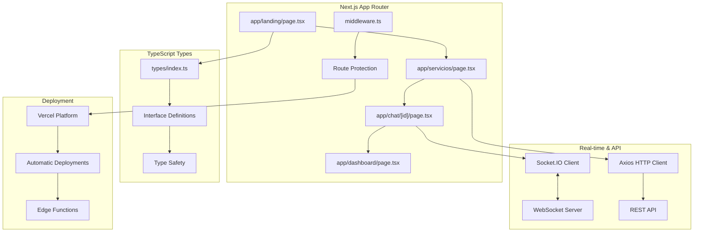

<div align="center">  
  <h1>🛠️ Servicio Libre</h1>  
  <p><strong>Plataforma de marketplace de servicios con chat en tiempo real</strong></p>  
  <p><em>Desarrollada con Next.js 15 + TypeScript | Desplegada en Vercel</em></p>  
    
    
    
    
    
    
    
  <br/>  
    
  <a href="https://servicio-libre.vercel.app" target="_blank">  
      
  </a>  
</div>  
  
---  
  
## 📋 Descripción  
  
**Servicio Libre** es una plataforma moderna construida con **Next.js 15** y **TypeScript** que conecta clientes con trabajadores a través de un sistema integrado de chat en tiempo real y gestión de contratos. [1](#1-0)  La aplicación facilita el descubrimiento de servicios, comunicación fluida entre usuarios y operaciones administrativas, desplegada de forma continua en **Vercel**.  
  
### ✨ Características Principales  
  
- 🔍 **Marketplace de Servicios**: Búsqueda y filtrado avanzado de servicios  
- 💬 **Chat en Tiempo Real**: Comunicación instantánea con Socket.IO  
- 📄 **Gestión de Contratos**: Sistema completo de acuerdos de servicio  
- 👥 **Multi-rol**: Soporte para clientes, trabajadores y administradores  
- 📱 **Responsive**: Diseño adaptativo con TailwindCSS  
- 🔐 **Autenticación OAuth**: Login con Google integrado  
- ⚡ **SSR/SSG**: Renderizado del lado del servidor con Next.js  
  
---  
  
## 🏗️ Arquitectura Next.js  
  
<div align="center">  
  


</div>

---

## 🛠️ Stack Tecnológico

<table>
<tr>
<td><strong>Frontend Framework</strong></td>
<td>

- **Next.js**: 15.3.3 (App Router) [2](#1-1) 
- **React**: 19.0.0 [3](#1-2) 
- **TypeScript**: 5.x para type safety [4](#1-3) 

</td>
</tr>
<tr>
<td><strong>Estilos & UI</strong></td>
<td>

- **TailwindCSS**: 4.x utility-first [5](#1-4) 
- **FontAwesome**: Iconografía completa
- **Lucide React**: Iconos modernos

</td>
</tr>
<tr>
<td><strong>Comunicación</strong></td>
<td>

- **Socket.IO Client**: 4.8.1 para chat real-time [6](#1-5) 
- **Axios**: 1.9.0 para HTTP requests [7](#1-6) 
- **NextAuth**: 4.24.11 para autenticación [8](#1-7) 

</td>
</tr>
<tr>
<td><strong>Deployment</strong></td>
<td>

- **Vercel**: Hosting y CI/CD automático
- **Edge Functions**: Para optimización global
- **Image Optimization**: Next.js Image component

</td>
</tr>
</table>

---

## 🚀 Inicio Rápido

### Prerrequisitos
- **Node.js** 18+ 
- **npm** o **yarn**
- Cuenta en **Vercel** (para deploy)

### Instalación Local

```bash
# Clonar el repositorio
git clone https://github.com/Servicios-Libre/frontend.git

# Navegar al directorio
cd frontend

# Instalar dependencias
npm install

# Configurar variables de entorno
cp .env.example .env.local

# Ejecutar en modo desarrollo
npm run dev
``` [9](#1-8) 

### 🌐 Acceso Local
Abre [http://localhost:3000](http://localhost:3000) en tu navegador para ver la aplicación.

### 🚀 Deploy en Vercel

```bash
# Instalar Vercel CLI
npm i -g vercel

# Deploy desde la terminal
vercel

# O conecta tu repo GitHub con Vercel para auto-deploy
```

---

## 📁 Estructura del Proyecto (Next.js App Router)

```
src/
├── app/                    # App Router (Next.js 13+)
│   ├── layout.tsx         # Layout principal
│   ├── page.tsx           # Página de inicio
│   ├── landing/           # Landing page
│   │   └── page.tsx
│   ├── servicios/         # Marketplace de servicios
│   │   └── page.tsx
│   ├── chat/              # Sistema de chat
│   │   └── [id]/page.tsx  # Chat dinámico
│   ├── dashboard/         # Panel administrativo
│   │   └── page.tsx
│   └── auth/              # Autenticación
│       └── page.tsx
├── components/            # Componentes reutilizables
│   ├── auth/             # Componentes de autenticación
│   ├── chat/             # Chat en tiempo real
│   ├── servicios/        # Marketplace
│   ├── dashboard/        # Admin panel
│   └── ui/               # Componentes UI base
├── context/              # React Context (Estado global)
├── hooks/                # Custom hooks
├── services/             # API services
├── types/                # Definiciones TypeScript
│   └── index.ts          # Interfaces principales
├── middleware.ts         # Next.js middleware
└── next.config.ts        # Configuración Next.js
```

---

## 🔧 Configuración Next.js

### next.config.ts
La aplicación está configurada para optimizar imágenes de Cloudinary y Google: [10](#1-9) 

### TypeScript Interfaces
Las interfaces principales definen la estructura de datos: [11](#1-10) 

---

## 👥 Roles de Usuario & Rutas

<div align="center">

| Rol | Características | Rutas Next.js |
|-----|----------------|---------------|
| **👤 Cliente** | Buscar servicios, iniciar chats | `/servicios`, `/chat/[id]`, `/profile` |
| **🔧 Trabajador** | Gestionar servicios, contratos | `/worker-profile`, `/chat/[id]` |
| **⚙️ Admin** | Gestión de usuarios, estadísticas | `/dashboard` |

</div>

---

## 🔄 Flujos Principales

### 🔍 Descubrimiento de Servicios
1. **Landing Page**: Componentes optimizados con SSR [12](#1-11) 
2. **Búsqueda**: Filtrado con estado del lado del cliente [13](#1-12) 
3. **Chat**: Integración con Socket.IO para tiempo real [14](#1-13) 

### 💬 Sistema de Chat en Tiempo Real
- **WebSocket**: Conexión persistente con Socket.IO
- **TypeScript**: Tipado fuerte para mensajes y contratos
- **Next.js API Routes**: Endpoints para inicialización de chats

---

## 🎨 Componentes UI Destacados

### 🏠 Landing Page
- **Componentes Server**: Renderizado del lado del servidor
- **Hydration**: Interactividad del lado del cliente
- **Image Optimization**: Next.js Image component

### 🛍️ Marketplace
- **Loading States**: Skeleton components [15](#1-14) 
- **Responsive Carousel**: Perfiles destacados [16](#1-15) 
- **Dynamic Routing**: Navegación con Next.js Router

---

## 🔧 Scripts de Desarrollo

```bash
# Desarrollo con hot reload
npm run dev

# Build optimizado para producción
npm run build

# Servidor de producción local
npm run start

# Linting con ESLint
npm run lint

# Type checking
npx tsc --noEmit
```

---

## 🚀 Deploy y CI/CD

### Vercel Integration
- **Auto Deploy**: Cada push a `main` despliega automáticamente
- **Preview Deployments**: Cada PR genera una preview URL
- **Edge Functions**: Optimización global de performance
- **Analytics**: Métricas de performance integradas

### Variables de Entorno
```bash
NEXT_PUBLIC_API_URL=your_api_url
NEXTAUTH_SECRET=your_nextauth_secret
NEXTAUTH_URL=your_domain
GOOGLE_CLIENT_ID=your_google_client_id
GOOGLE_CLIENT_SECRET=your_google_client_secret
```

---

## 📊 Performance & SEO

- **Core Web Vitals**: Optimizado para métricas de Google
- **SSR/SSG**: Renderizado híbrido según la página
- **Image Optimization**: Lazy loading y formatos modernos
- **Bundle Analysis**: Optimización de tamaño de bundle
- **TypeScript**: Detección temprana de errores

---

## 🤝 Contribución

1. Fork el proyecto
2. Crea una rama para tu feature (`git checkout -b feature/AmazingFeature`)
3. Asegúrate de que el código pase TypeScript (`npm run type-check`)
4. Commit tus cambios (`git commit -m 'Add some AmazingFeature'`)
5. Push a la rama (`git push origin feature/AmazingFeature`)
6. Abre un Pull Request

### Estándares de Código
- **TypeScript**: Tipado fuerte obligatorio
- **ESLint**: Configuración Next.js estándar
- **Prettier**: Formateo automático de código
- **Conventional Commits**: Para mensajes de commit

---

## 📄 Licencia

Este proyecto está bajo la Licencia MIT. Ver el archivo `LICENSE` para más detalles.

---

<div align="center">
  <h3>🌟 Tecnologías Principales</h3>
  <p>
    
  </p>
  
  <p><strong>Hecho con ❤️ por el equipo de Servicio Libre</strong></p>
  <p>Desarrollado con Next.js 15 + TypeScript | Desplegado en Vercel</p>
  
  <p>
    <a href="#top">⬆️ Volver arriba</a> |
    <a href="https://servicio-libre.vercel.app" target="_blank">🚀 Ver Demo</a> |
    <a href="https://github.com/Servicios-Libre/frontend/issues" target="_blank">🐛 Reportar Bug</a>
  </p>
</div>
```
